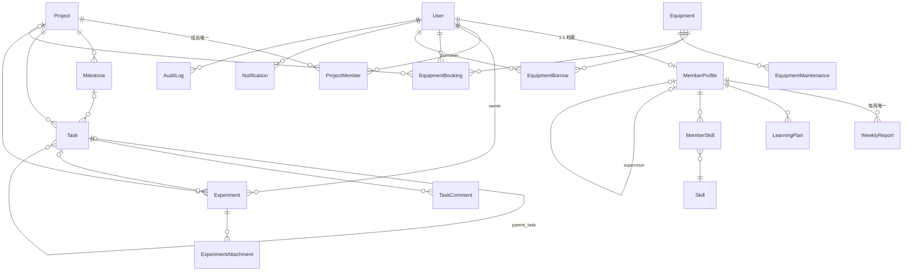

# 数据库说明（PostgreSQL 16）

## ER 关系图



## 表清单（18 张业务表 + alembic_version）

| 表 | 说明 | 关键约束/索引 |
| --- | --- | --- |
| users | 用户 | username UNIQUE、email UNIQUE、role/status 索引 |
| member_profiles | 成员档案 | user_id UNIQUE FK、supervisor 自引用、member_type/status 索引 |
| skills | 技能定义 | name UNIQUE |
| member_skills | 成员技能 | (member_id, skill_id) UNIQUE |
| learning_plans | 学习计划 | member_id FK、status/target_date 索引 |
| weekly_reports | 周报 | (member_id, week_start) UNIQUE、status 索引 |
| projects | 项目 | code UNIQUE、deleted_at 软删除、status 索引 |
| project_members | 项目成员 | (project_id, user_id) UNIQUE、left_at 逻辑退组 |
| milestones | 里程碑 | project_id FK、due_date 索引 |
| tasks | 任务 | project_id/assignee_id/due_date 索引、软删除 |
| task_comments | 任务评论 | task_id FK CASCADE |
| experiments | 实验记录 | experiment_no UNIQUE、软删除、is_locked |
| experiment_attachments | 实验附件 | experiment_id FK、元数据入库（storage_path 指向文件卷） |
| equipment | 设备台账 | asset_no UNIQUE、软删除、status 索引 |
| equipment_bookings | 设备预约 | equipment_id/user_id/start_time/end_time 索引；时间冲突在 service 层校验 |
| equipment_borrows | 设备借用 | status 索引 |
| equipment_maintenance | 故障维修 | equipment_id/type/status 索引 |
| notifications | 站内通知 | user_id/is_read 索引 |
| audit_logs | 操作日志 | user_id/action/created_at 索引 |

## 约束要点（对应 PRD §18）

1. username UNIQUE；email UNIQUE（可配置字段）
2. asset_no / experiment_no / project.code UNIQUE
3. ProjectMember(project_id, user_id) UNIQUE
4. MemberSkill(member_id, skill_id) UNIQUE
5. WeeklyReport(member_id, week_start) UNIQUE
6. 预约冲突：service 层执行 `new_start < existing_end AND new_end > existing_start`（仅 pending/approved 参与），应用层再加相邻时间（end==start）允许的语义
7. 所有外键建立索引；status/due_date/project_id/user_id/member_id/equipment_id 均有索引
8. 全表 created_at/updated_at（naive UTC）；created_by 记录在学习计划/任务/周报审核等

## 迁移与种子

```bash
cd backend
alembic upgrade head        # 全部迁移
python -m app.seed          # 幂等种子（12 账号/3 项目/任务/周报/实验/设备…）
alembic current             # 应显示 2085ac133de4 (head)
```
